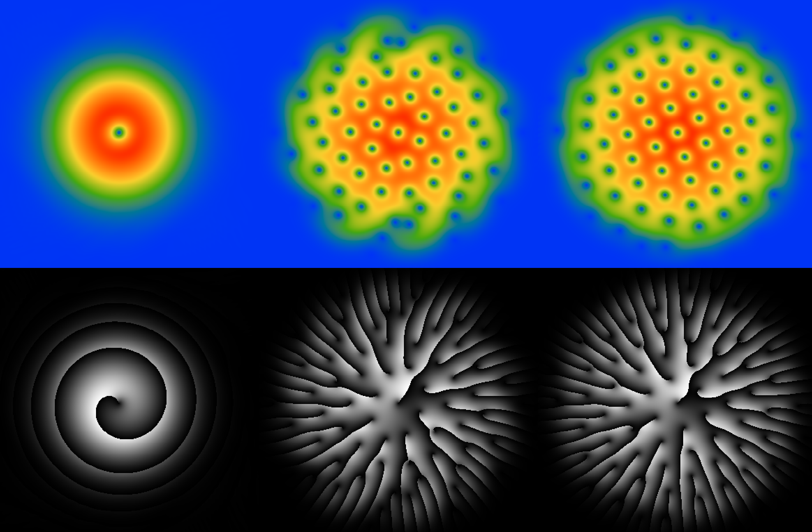
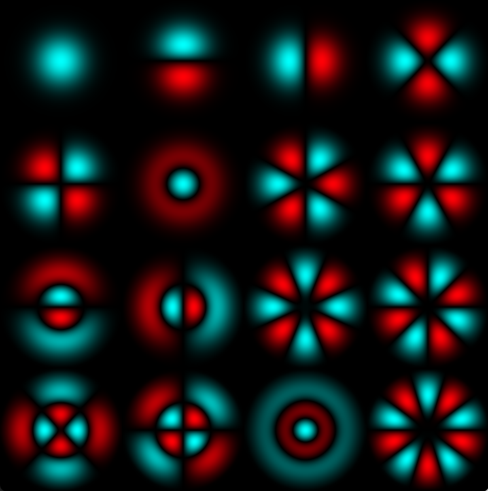

# Quantum vortices

This repository provides tools for solving the nonlinear Schrödinger equation arising in a wide range of applications, ranging from Bose-Einstein condensation of ultracold atoms and superconductivity to superfluid-related cosmic phenomena.

## Features
- Real and imaginary time evolution
- Calculation of eigenvalues and eigenvectors

### Installation
To build this project from the source code in this repository you need to have the following:
- Intel Fortran and C++ compilers
- GLFW version 3.4 or newer
- OpenGL version 4.1
- Intel MKL
- Arpack-ng

### Building
To generate the executables, run the 'make' command in the root directory.

## Gallery

Here are some pictures to illustrate the project: (top) formation of a hexagonal lattice of vortices in the Bose Einstein condensate and (bottom) the eigenstates of a harmonic oscillator.

  
  

