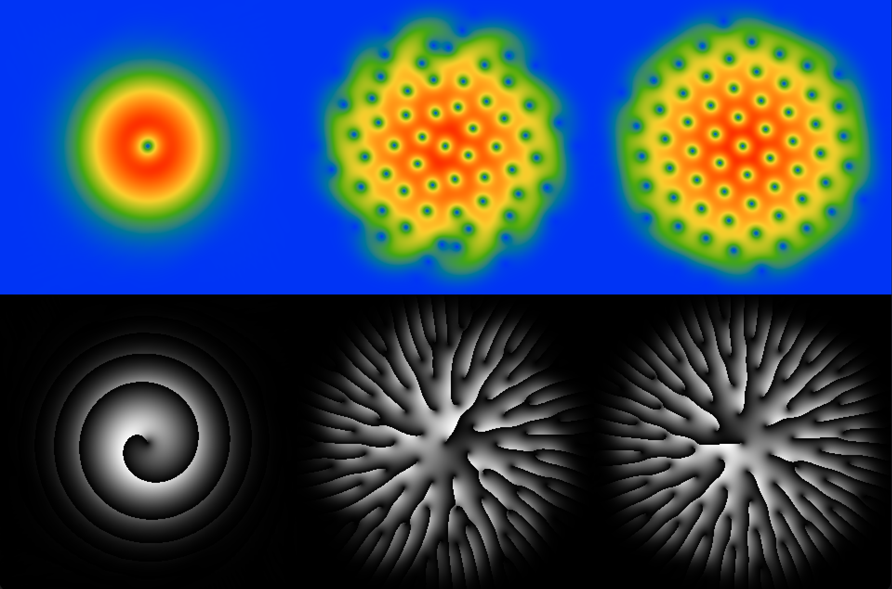

# Quantum vortices

This repository provides powerful tools for solving the nonlinear Schrödinger equation in a wide range of applications,
ranging from ultra-cold atoms and superconductivity to cosmic phenomena modeled as superfluids.

## Features
- Calculation of the eigenvalues and the eigenvectors
- Real and imaginary time preparation

### Prerequisites
- Intel Fortran and C++ compilers
- Dependencies (GLFW, OpenGL, Intel MKL, Arpack)

## Usage
To build the project, run the 'make' command in the root directory. This will generate the executables.

## Gallery

Here are some pictures to illustrate the project: Formation of a gexagonal lattice of vortices in the Bose Einstein condensate (left) and the eigenstates of a harmonic oscillator (right).

   &nbsp
  

