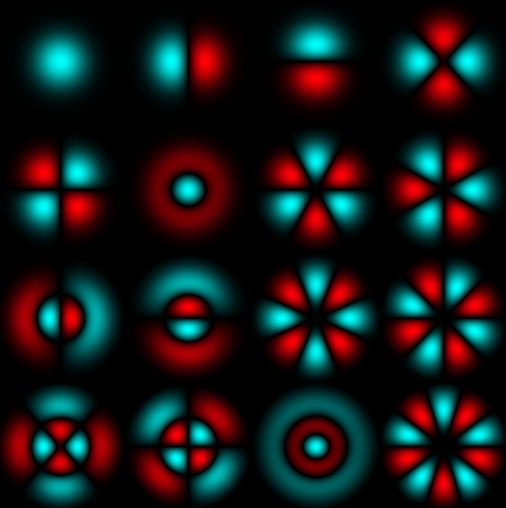

[](https://en.cppreference.com/w/cpp/11)
[](https://en.wikipedia.org/wiki/Fortran_2003)
[](https://www.glfw.org)
[](https://www.opengl.org/)
[](https://software.intel.com/content/www/us/en/develop/tools/math-kernel-library.html)
[](https://github.com/opencollab/arpack-ng)


# Quantum algorithms

This repositariy offers tools to solve
A brief description of the project and its purpose.

## Features
- Feature 1
- Feature 2
- Feature 3

### Prerequisites
- Python 3.x
- Dependencies (list of libraries)

## Usage
To run the project, use:
```sh
conda install fvdfvfd
```

## Gallery

Here are some images showcasing the project:

<p>
   &nbsp
  
</p>

$$
E= \sqrt{x^2+1}
$$
